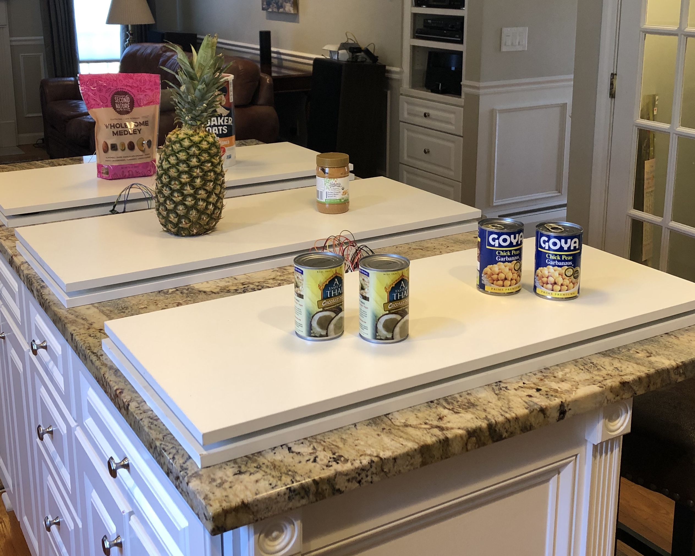
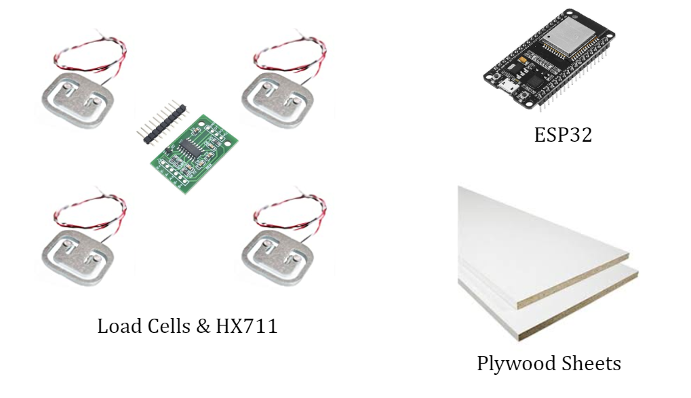
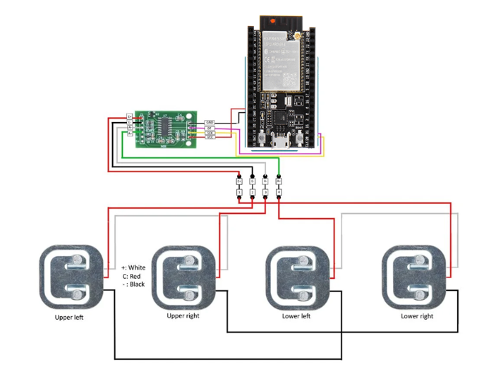
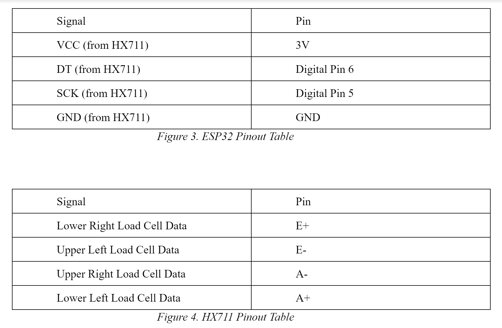
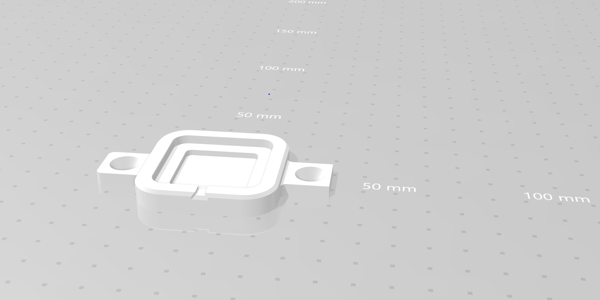
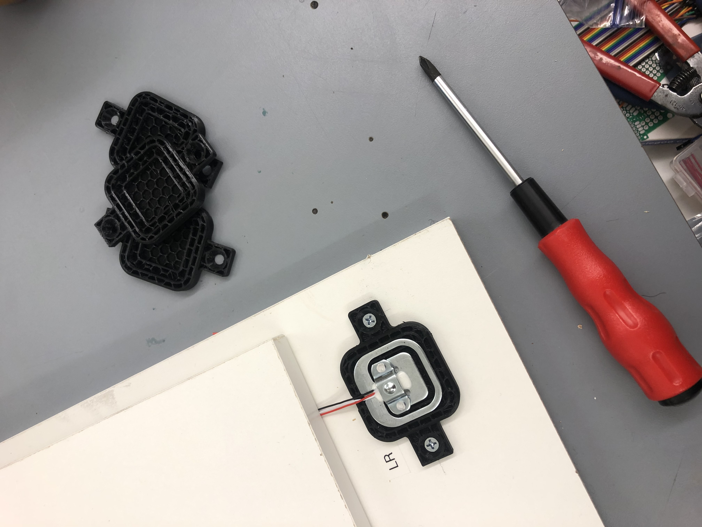
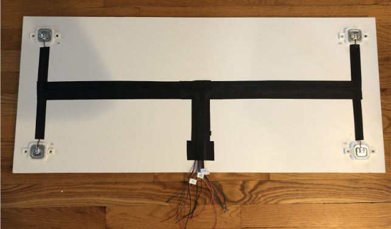
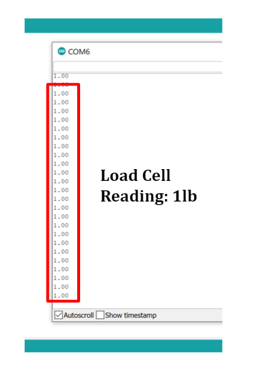
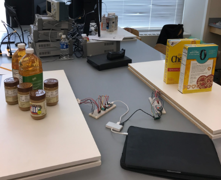
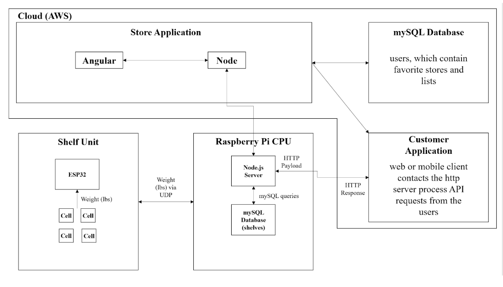

# Hardware

Our hardware deliverable was the smart shelving unit. This smart shelving unit automates the inventory updating process. We constructed a total of three smart shelving units. Each smart shelving units is made up of four load cells (one load cell at each corner of the shelving unit), a HX711 module (ADC module), an ESP32 module, and two plywood sheets. 

Before construction of the smart shelving units, we tested with one load cell, and then we tested with all four load cells together. Through this testing, we determined that the load cells needed more stabilization. Therefore, we designed 3D printed mounts for the load cells. These mounts proved essential, as the load cell readings became very stable once the load cells were inserted into these mounts. Once testing was completed, we secured the mounts with the load cells inserted to a 3' x 1.5' plywood sheet (one load cell at each corner) by screwing down the mounts to the sheet. Then, we soldered the load cell wires to other wires and heat shrunk each of these connections. We did this carefully, as we wanted to assure that the connection between the load cells and the HX711 was good. Then, we taped all of these wires to the plywood sheet in an organized fashion. We did this to organize our connections and make the bottom side of the shelf more easily accessible and more aesthetically pleasing. Then, we labeled the load cells (top left, top right, bottom left, bottom right) and we labeled the wires (top left, top right, bottom left, bottom right). Again, we did this to organize. Then, we wired the load cells together using the circuit schematic shown below. Then, we connected the load cells to the HX711 and connected the HX711 to the ESP32 based on the pinouts shown below. Then, we connected the ESP32 to a computer, and loaded the calibration sketch onto the ESP32. We determined the calibration factor by following the instructions in the calibration sketch. We then changed the calibration factor in the testing sketch and loaded the testing sketch onto the ESP32. After following these steps, our shelving units were completed, and the weight readings for these shelves were accurate and stable (after some debugging of course)!

The four load cells detect item weight and interface with the HX711 module. The HX711 module is a precision analog to digital converter that converts a detected analog voltage to a digital value. The HX711 module interfaces with the ESP32. Diagrams and pinouts for the load cells, HX711, and ESP32 can be found below. The ESP32 utilizes the HX711 library provided by the Arduino IDE to detect the current weight of the shelf. The ESP32 communicates the detected weight, once the weight has stabilized, to the store CPU via a Linksys router. The shelf’s ESP32 determines that the weight of the shelf has stabilized and sends this weight to the store CPU when the current weight reading is within 0.05 lbs of the previous weight reading. This delay in communication assures that the shelf’s ESP32 does not send weight readings that are a byproduct of a store employee or customer touching the shelf, or a byproduct of the load cells taking a few seconds to stabilize once a grocery store item has been placed on or removed from the shelf.

Our system currently includes three smart shelving units that communicate to the store CPU simultaneously. The weight readings communicated to the store CPU are organized by the IP address of the ESP32 of each shelf. Therefore, our current store CPU expects three weight readings from three different shelves with three different IP addresses. Shelf 1 has IP address 192.168.1.138, Shelf 2 has IP address 192.168.1.100, and Shelf 3 has IP address 192.168.1.119. The CPU receives the weight readings from these three shelves and detects item placement on and removal from these shelves.

Here is an image of our final product (three functional smart shelving units):

Shelf Components:

Circuit Schematic:

ESP32 Pinouts:

Load Cell Mount CAD Drawing:

3D Printed Load Cell Mounts:

Bottom Side of the Shelf:

Extremely Accurate and Stable Load Cell Output (1lb for 1lb Peanut Butter):

1lb Peanut Butter on Shelf for Above Reading:

Shelf Image:

Shelf Image:

System Diagram:

